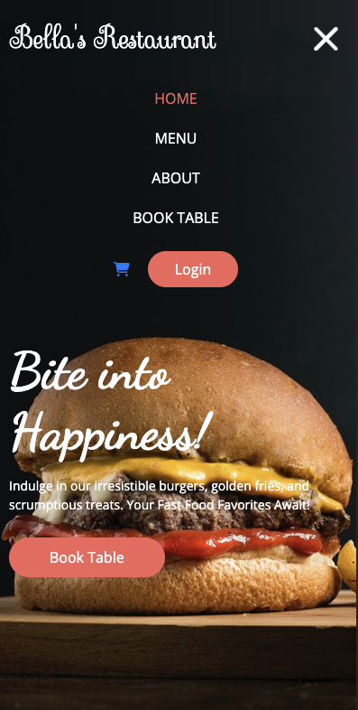

# Bella's Restaurant


Bella's Restaurant is a full stack restaurant management website built using Django, Python, HTML, CSS, and JavaScript. The website supports online food ordering and table reservations. It uses PostgreSQL for the database management.

This project was created to showcase a comprehensive restaurant management system with role-based functionalities.

[Visit Bella's Restaurant Here](https://bella-restaurant-730f308dde58.herokuapp.com/)

  

---

## User Experience

### Strategy Plane

#### **Project Goals**

Bella's Restaurant is designed to cater to the needs of a restaurant environment, focusing on online food ordering and table reservations. The primary audience includes restaurant managers, staff, and customers. The site aims to provide a seamless experience for all user roles:

- **Admins**: Manage the entire system including food items, staff, and reservations.
- **Managers**: Handle orders, reservations, and approval of pending requests.
- **Customers**: Browse the menu, place orders, and make reservations.

The goal is to streamline restaurant operations and enhance customer experience by providing an intuitive interface for each user role.

### Scope Plane

#### **Feature Planning**

Below is a table of opportunities for the project, rated on their importance and viability. Features with high scores are prioritized for the MVP, while lower-scored features are planned for future development.

User roles are key to the site’s functionality, distinguishing between Admins, Managers, and Customers, each with specific capabilities.

| User Type | Feature | Importance | Viability |  | Delivered |
| :--- | :--- | :---: | :---: | :---: | :---: |
| | User roles | 5 | 5 | MVP | ✅ |
| Customer | Sign up for an account | 4 | 5 | MVP | ✅ |
| Customer & Admin | Account Profile | 4 | 5 | MVP | ✅ |
| Customer | Password recovery | 5 | 5 | MVP | ✅ |
| Manager & Admin | Manage orders and reservations | 5 | 5 | MVP | ✅ |
| Admin | Add and manage food items | 5 | 5 | MVP | ✅ |
| Admin | Add, delete, and manage staff | 5 | 5 | MVP | ✅ |
| Customer | Place online orders | 5 | 5 | MVP | ✅ |
| Customer | Make table reservations | 5 | 5 | MVP | ✅ |
| Admin | View and generate reports | 4 | 4 | | ✅ |
| | Terms and Conditions | 3 | 5 | | ✅ |
| | Privacy Policy | 3 | 5 | | ✅ |
| | Social Media Links | 3 | 5 | | ✅ |
| All | Contact form | 3 | 3 | | ✅ |

### Structure Plane

#### **User Stories**

| User Story ID | As a/an | I want to be able to ... | So that I can... |
| :--- | :--- | :--- | :---|
| **VIEWING & NAVIGATION** |
| 1 | Customer | Easily browse the menu | View available food options |
| 2 | Customer | View detailed descriptions of dishes | Make informed choices about what to order |
| 3 | Customer | Easily navigate to the order and reservation sections | Quickly place orders or make reservations |
| **REGISTRATION & USER ACCOUNTS** |
| 4 | Customer | Register for an account | Create a personalized experience and track my orders |
| 5 | Customer | Log in and out | Securely manage my account information |
| 6 | Customer | Reset my password | Recover access to my account if I forget my password |
| **ORDERING & RESERVATIONS** |
| 7 | Customer | Place an order online | Enjoy a seamless ordering experience |
| 8 | Customer | Make a reservation for a table | Ensure a spot is available when I arrive at the restaurant |
| 9 | Manager | Approve or disapprove orders | Manage pending orders efficiently |
| 10 | Manager | Manage table reservations | Ensure smooth seating arrangements for customers |
| **ADMIN & RESTAURANT MANAGEMENT** |
| 11 | Admin | Add new food items | Update the menu with new dishes |
| 12 | Admin | Edit or delete food items | Maintain the accuracy of the menu |
| 13 | Admin | Add and manage restaurant staff | Ensure proper staffing and management |
| 14 | Admin | Generate reports on orders and reservations | Analyze restaurant performance and trends |

---

## Database Schema

Due to the requirements of the project, a relational database was chosen to best suit the needs of Bella's Restaurant. The database schema has been designed to ensure efficient data management and retrieval.

After consulting with a mentor, it was recommended to normalize the database schema. This involves reducing redundancy by ensuring that data is not duplicated across tables. As a result, the `User` table was updated to include full name, phone number, and address details, and these fields were removed from the `UserProfile` table. Similarly, duplicated user information in the `Order` table was consolidated into the `User` table. The `Product` table no longer includes the `sizes` column as it was deemed unnecessary.

Some fields were adjusted in the schema diagrams due to limitations of the diagramming tool.


## Skeleton Plane

### **Wireframes**

Wireframes for the Bella's Restaurant project were created using [wireframe](https://wireframe.cc/).


* **Base Template** - This template contains the header and footer, which are used throughout the website. The base template is used as a foundation, with specific page content injected into the main section using Django's template language.


   


* **Home Page** - The homepage features a header banner, a menu, and a footer. It provides an overview of the restaurant and links to other pages.

  


* **Menu Page** - The menu page displays a list of all dishes available at Bella's Restaurant, including descriptions and prices.

   


* **About Page** - The about page provides information about Bella's Restaurant, including its history, mission, and values.

    


* **Book Page** - The booking page allows customers to reserve a table at Bella's Restaurant. Users can select the date, time, and number of people for their reservation.

    


* **Cart Page** - The cart page shows the food items added by the user and provides an option to proceed to checkout. Users can review their order and make changes if necessary.

    


* **Login Page** - The login page allows users to access their account by entering their username and password. If users do not have an account, they can register from this page.

    


* **Register Page** - The register page enables users to create a new account by providing their username, password, and email address. Users can also register using their social media accounts.

    

# Bella's Restaurant Website

## General Features of the Site

Each page of Bella's Restaurant website includes:

* **Favicon** - The favicon for the site was created using [Favicon.io](https://favicon.io/). To ensure clarity, the favicon uses the initials of Bella's Restaurant in a font and color matching the site.

  

* **Navbar** - The navbar is divided into two sections:
  - The first section includes account icon, and reservation icon.
  - The second section lists the site's menu categories. The navbar is fully responsive, utilizing a hamburger menu toggle on smaller screens. The hamburger icon rotates 90 degrees on click to provide visual feedback.

  The category links in the navbar have a hover effect that moves the category name up, providing selection feedback. The account icon includes a dropdown menu that varies based on user status (logged in, superuser).

  
  

* **Footer** - The footer is segmented into four sections:
  - Information about the site, including terms and conditions and policies.
  - Contact information with a link to the contact and social media links.
  - Details about reservations.
  - A disclaimer

  The footer is fully responsive, stacking sections on smaller screens.

  
  

### **Site Header and Footer Images**

The site does not currently feature the header and footer images due to issues with resizing SVG files. Adding these images is planned for the next version, along with performance optimizations to maintain high performance scores.

### **Defensive Programming**

Defensive programming techniques are implemented to ensure users cannot access pages beyond their permission level. For admin tasks, only superusers can perform these actions. Unauthorized access attempts result in an error message indicating insufficient permissions.

### **Features for Next Version**

Upcoming features and improvements:
- Wishlist and review functionalities.
- Integration of social media logins.
- Enhanced header and footer images.
- Adjustments to mobile navbar toggler positioning and alignment.

### **Home Page**

The home page welcomes users with a message and displays cards representing different menu categories. Clicking a card takes the user to that category's page. Future updates will include category images to improve visual representation.


### **Menu Page**

The Menu page lists dishes with images (or a default placeholder if no image is available), names, prices. Superusers have the ability to update or delete dishes directly from this page. Users can sort dishes by price, rating, or category using a dropdown menu.


### **Dish Details Page**

The Dish Details Card offers detailed information about a selected dish. An image of the dish is shown alongside its name, price, description, and tags. Superusers can edit or delete dish details from this page and add dishes to their cart.


### **Cart Page**

The Cart page displays all items added to the cart, including images, names, prices, quantities, and subtotals. Users can adjust quantities or remove items. The total cost, including delivery fees, is shown, and users are informed if they need to spend more to qualify for free delivery. Navigation options are provided to return to the menu or proceed to checkout.


### **Checkout Page**

Users can either adjust their cart or complete their order. A checkout payment overlay shows a processing spinner while the payment is being processed.


### **Admin HomePage Overlay**

Admin can see Users, food, foodType and orders. You can visit the admin page using the Link: [Admin Page](https://bella-restaurant-730f308dde58.herokuapp.com/admin/login/?next=/admin/)


### Future Implementations

In future implementations, I would like to:

* Allow coupons to be accepted during the checkout process.
* Send newsletters to users.
* Implement social login options.
* Add user reviews for dishes with a rating facility.
* Implement a wish list functionality, allowing users to add and remove dishes from their wish list and share products with others through social links on the product details page.
* Create user groups on the admin page to facilitate sending specific emails, such as birthday coupons or loyalty rewards. This section could also be used to create different mailing groups for newsletters based on user preferences.

## Accessibility

I have been mindful during development to ensure that the website is as accessible as possible. This has been achieved by:

* Using semantic HTML.
* Applying descriptive alt attributes on images throughout the site.
* Providing information for screen readers where icons are used without accompanying text.
* Ensuring sufficient color contrast throughout the site. (Details on the chosen color scheme are explained in the color scheme section.)

Accessibility was tested using Lighthouse and WAVE. Further information can be found in the [TESTING.md](TESTING.md).

---

## Technologies Used

### Languages Used

HTML, CSS, JavaScript, Python

### Database Used

sqlite3 for development.

[PostgreSQL](https://www.postgresql.org/) for deployed site.

### Frameworks Used

[Django](https://www.djangoproject.com/) - Version ~~3.2.16~~ 3.2.25- A high-level Python web framework that encourages rapid development and clean, pragmatic design.

[Bootstrap](https://getbootstrap.com/docs/4.6/getting-started/introduction/) - Version 4.6.2 - A framework for building responsive, mobile-first sites.

### Libraries & Packages Used

[jQuery](https://jquery.com/) - Version 3.6.2 - A JavaScript Framework

[Font Awesome](https://fontawesome.com/) - Version 6.2.1 - Used for the iconography of the site, this was added using a CDN link.

[django_crispy_forms](https://pypi.org/project/django-crispy-forms/) - provides a tag and filter that lets you quickly render forms

[gunicorn](https://pypi.org/project/gunicorn/) - a Python WSGI HTTP Server

[pillow](https://pypi.org/project/Pillow/) - Python imaging library

[dj_databsae_url](https://pypi.org/project/dj-database-url/) - allows us to utilise the DATABASE_URL variable

[psycopg2](https://pypi.org/project/psycopg2/) - a postgres database adapter which allow us to connect with a postgres database

[django-environ](https://pypi.org/project/django-environ/) - allows us to configure Django application with environment variables.

[sqlparse](https://pypi.org/project/sqlparse/) - allows us to support for parsing, splitting and formatting SQL statements.

[typing_extensions](https://pypi.org/project/typing-extensions/) - provide standard-library typing module, providing runtime support for type hints 

[django-heroku](https://pypi.org/project/django-heroku/) - allows us to seamless deployment and development experience.


### Programs Used

[Am I Responsive](https://ui.dev/amiresponsive) - To create the responsive images of the site on a variety of device sizes.

[Balsamiq](https://balsamiq.com/) - Used to create wireframes.

[DrawSQL.app](https://drawsql.app/) - Used to create the database schema.

[Favicon.io](https://favicon.io/) - To create the favicon.

[Git](https://git-scm.com/) - For version control.

[GitHub](https://github.com/) - To save and store the files for this project.

[Google Dev Tools](https://developer.chrome.com/docs/devtools/) - To troubleshoot, test features and solve issues with responsiveness and styling.

[Pip](https://pypi.org/project/pip/) - A tool for installing Python packages.

[Shields.io](https://shields.io/) - To add badges to the projects documentation.

[Tiny PNG](https://tinypng.com/) - To compress images used in the README.

[Cloud Convert](https://cloudconvert.com/eps-to-svg) - To convert EPS files to SVG files for the vector images.


## Deployment & Local Development

### Deployment

The project is deployed using Heroku. To deploy the project:

#### Create the Live Database

The project uses SQLite in development but requires an external PostgreSQL database for production. To set up the external database:

1. Go to the [PostgreSQL dashboard](https://www.heroku.com/postgresql) and create a new database instance.
2. Name database instance (e.g., bellar), choose the free tier if available, and select the closest region. Follow the prompts to create the instance.
3. Once created, navigate to the dashboard, select new database, and copy the connection URL.

#### Heroku App Setup

  1. From the [Heroku dashboard](https://dashboard.heroku.com/), click the new button in the top right corner and select create new app.
  2. Give app a name (this must be unique), select the region that is closest to you and then click the create app button bottom left.
  3. Open the settings tab and create a new config var of `DATABASE_URL` and paste the database URL you copied from elephantSQL into the value (the value should not have quotation marks around it).

#### **Preparation for deployment in GitPod**

1. Install dj_database_url and psycopg2 (they are both needed for connecting to the external database you've just set up):

   ```bash
   pip3 install dj_database_url==0.5.0 psycopg2
   ```

2. Update requirements.txt file with the packages just installed:

    ```bash
    pip3 freeze > requirements.txt
    ```

3. In settings.py underneath import os, add `import dj_database_url`

4. Find the section for DATABASES and comment out the code. Add the following code below the commented out database block, and use the URL copied from elephantSQL for the value:

    (NOTE! don't delete the original section, as this is a temporary step whilst we connect the external database. Make sure you don't push this value to GitHub - this value should not be saved to GitHub, it will be added to the Heroku config vars in a later step, this is temporary to allow us to migrate our models to the external database)

    ```python
    DATABASES = {
        'default': dj_database_url.parse('paste-elephantsql-db-url-here')
    }
    ```

5. In the terminal, run the show migrations command to confirm connection to the external database:

    ```bash
    python3 manage.py runserver
    ```

6. If you have connected the database correctly you will see a list of migrations that are unchecked. You can now run migrations to migrate the models to the new database:

    ```bash
    python3 manage.py migrate
    ```

7. Create a superuser for the new database. Input a username, email and password when directed.

    ```bash
    python3 manage.py createsuperuser
    ```

8. You should now be able to go to the browser tab on the left of the page in elephantsql, click the table queries button and see the user you've just created by selecting the auth_user table.
9. We can now add an if/else statement for the databases in settings.py, so we use the development database while in development (the code we commented out) - and the external database on the live site (note the change where the db URL was is now a variable we will use in Heroku):

    ```python
    if 'DATABASE_URL' in os.environ:
        DATABASES = {
          'default': dj_database_url.parse(os.environ.get('DATABASE_URL'))
        }
    else:
        DATABASES = {
            'default': {
                'ENGINE': 'django.db.backends.sqlite3',
                'NAME': os.path.join(BASE_DIR, 'db.sqlite3')
          }
        }
    ```

10. Install gunicorn which will act as our webserver and freeze this to the requirements.txt file:

    ```bash
    pip3 install gunicorn
    pip3 freeze > requirements.txt
    ```

11. Create a `Procfile` in the root directory. This tells Heroku to create a web dyno which runs gunicorn and serves our django app. Add the following to the file (making sure not to leave any blank lines underneath):

    ```Procfile
    web: gunicorn seaside_sewing.wsgi:application
    ```

12. Log into the Heroku CLI in the terminal and then run the following command to disable collectstatic. This command tells Heroku not to collect static files when we deploy:

    ```bash
    heroku config:set DISABLE_COLLECTSTATIC=1 --app heroku-app-name-here
    ```

13. We will also need to add the Heroku app and localhost (which will allow GitPod to still work) to ALLOWED_HOSTS = [] in settings.py:

    ```python
    ALLOWED_HOSTS = ['{heroku deployed site URL here}', 'localhost' ]
    ```

14. Save, add, commit and push the changes to GitHub. You can then also initialize the Heroku git remote in the terminal and push to Heroku with:

    ```bash
    heroku git:remote -a {app name here}
    git push heroku master
    ```

15. You should now be able to see the deployed site (without any static files as we haven't set these up yet).

16. To enable automatic deploys on Heroku, go to the deploy tab and click the connect to GitHub button in the deployment method section. Search for the projects repository and then click connect. Click enable automatic deploys at the bottom of the page.

#### **Generate a SECRET KEY & Updating Debug**

1. Django automatically sets a secret key when you create project, however we shouldn't use this default key in our deployed version, as it leaves our site vulnerable. We can use a random key generator to create a new SECRET_KEY which we can then add to our Heroku config vars which will then keep the key protected.
2. [Django Secret Key Generator](https://miniwebtool.com/django-secret-key-generator/) is an example of a site we could use to create our secret key. Create a new key and copy the value.
3. In Heroku settings create a new config var with a key of `SECRET_KEY`. The value will be the secret key we just created. Click add.
4. In settings.py we can now update the `SECRET_KEY` variable, asking it to get the secret key from the environment, or use an empty string in development:

    ```python
    SECRET_KEY = os.environ.get('SECRET_KEY', ' ')
    ```

5. We can now adjust the `DEBUG` variable to only set DEBUG as true if in development:

    ```python
    DEBUG = 'DEVELOPMENT' in os.environ
    ```

6. Save, add, commit and push these changes.


# Bella's Restaurant

Welcome to Bella's Restaurant, an online platform where you can order delicious food and make reservations with ease. This repository contains the code for the Bella's Restaurant website, built with Django and PostgreSQL.

## Local Development

### **How to Fork**

To fork the repository:

1. Log in (or sign up) to GitHub.
2. Go to the repository for this project, [bella's-restaurant](https://github.com/annabellaals/Bella_restaurant).
3. Click on the fork button in the top right of the page.

### **How to Clone**

To clone the repository:

1. Log in (or sign up) to GitHub.
2. Go to the repository for this project, [bella's-restaurant](https://github.com/annabellaals/Bella_restaurant).
3. Click the Code button, select whether you would like to clone with HTTPS, SSH, or the GitHub CLI, and copy the link provided.
4. Open the terminal in chosen IDE and change the current working directory to the location you would like to use for the cloned repository.
5. Type the following command into the terminal: `git clone` followed by the link you copied in step 3.
6. Set up a virtual environment (this step is not required if you are using an integrated development environment like GitPod which sets it up for you).
7. Install the packages from the `requirements.txt` file by running the following command in the terminal:

    ```bash
    pip install -r requirements.txt
    ```

### **Database Setup**

1. Ensure PostgreSQL is installed and running on local machine.
2. Create a PostgreSQL database for the project.
3. Update the `DATABASES` setting in the `settings.py` file with database credentials.
4. Run migrations to set up the database schema:

    ```bash
    python manage.py migrate
    ```

5. Create a superuser to access the Django admin:

    ```bash
    python manage.py createsuperuser
    ```

---

## Testing

Please refer to the [TESTING.md](TESTING.md) file for all testing performed.

---

## Credits

### Code Used

This project leverages various techniques and code snippets from Django's documentation and online resources. Special thanks to [Django Documentation](https://docs.djangoproject.com/en/stable/) for its invaluable guidance.

### Content

Content for the site was created by me, with specific descriptions and menu items crafted to reflect the unique offerings of Bella's Restaurant.

### Media

* [Foodies Feed](https://www.foodiesfeed.com/) - For providing high-quality images of dishes used in the website.
* [Canva](https://www.canva.com/) - Created the logo and other graphical elements for Bella's Restaurant using Canva's design tools.

### Acknowledgments

I would like to acknowledge the following people who have contributed to the completion of this project:

* My support system at home for being patience and the hands-on constant advice
* Credits to Code Institute, help from mentor Greame, and slack community
* Credits to Harvard´s Online courses
* Credits to W3schools
* Credits to Udemy
* Credits to code Institute students, helped me on-hand

---
